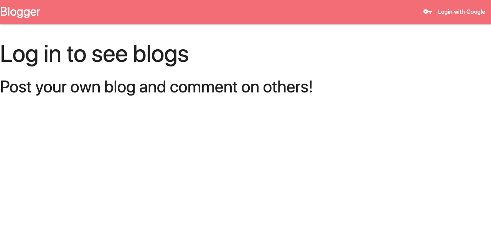
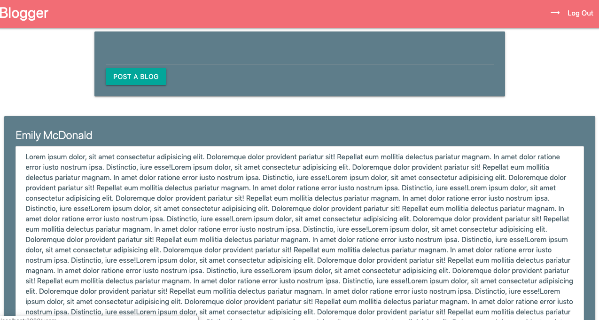

# Bloggers 

## Screenshots 
 
 

## Technologies Used 
### JavaScript, HTML, CSS, Express 

## Getting Started 
### [Link to Blogger app](https://afternoon-brook-18298.herokuapp.com/users#) 
### The Blogger app is a simple web app that allows users log in  post a blog and view others blog post as well. The user also has the ability to comment on anyone's blob post. 

## Next Steps 
### Add the ability to add pictures to blogs.
### Add the ability for users to create a profile with profile picture. 
